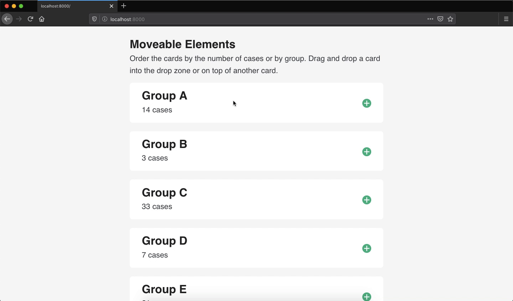

## Contents

1. [Why would I need this?](#about)
2. [How does this app work?](#work)
    1. [Creating a draggable functional component](#work-component)
    2. [Developing the UI and integrating the draggable component](#work-ui)
    3. [Defining styles for drag events](#work-css)
    4. [Writing the drag and drop events](#work-events)
        1. [Defining variables and a helper function](#work-events-vars)
        2. [Event for dragstart](#work-events-dragstart)
        3. [Event for dragend](#work-events-dragend)
        4. [Event for dragover](#work-events-dragover)
        5. [Event for dragenter](#work-events-dragenter)
        6. [Event for dragleave](#work-events-dragleave)
        6. [Event for drop](#work-events-drop)
3. [What do I need to know before I integrate this into my app?](#know)
4. [How do I run the demo](#run)

<!-- endexcerpt -->

<span id="about" />

## Why would I need this?

[tbd]

In this tutorial, I will cover the basic elements for creating draggable elements in shiny. I will focus on creating a draggable elment and the corresponding js events. I will also cover a little bit of css, specifically the classes are added when an element is dragged. I will try to keep the concepts simple and provide links for further reading where applicable. If you have any questions or if something is not clear, feel free to open a new issue.

For more information, please see the [drag and drop API](https://developer.mozilla.org/en-US/docs/Web/API/HTML_Drag_and_Drop_API) documentation.

<span id="work" />

## How does this app work?

We will build an app that allows users to reorder a series cards in any order (see the following gif).

<!--  -->

In this example, users can reorder a series of cards. Each card a group assignment (i.e., letters A through E) and a random value (i.e., 1 through 50). Users can reorder the cards by name, by value or any method they choose. Cards can be moved by clicking and then dragging the card up or down the page. When the user drops the card, the card will be inserted into that space (either before or after).

In this tutorial, I will cover the following items.

1. Creating a draggable functional component
2. Developing the UI and integrating the draggable component
3. Defining styles for drag events
4. Writing the drag and drop events

Before we get started, start by creating a new shiny app. I am using the `app.R` format and have created the js and css files. Your project directory should look like this. I also saved the draggable component in a separate file.

```text
> drag-and-drop/
    + app.R
    + draggable_card.R
    + www/
       - styles.css
       - index.js
```

<span id="work-component" />

### Creating a draggable functional component

The most important aspect to creating a draggable component is the attribute [draggable](https://developer.mozilla.org/en-US/docs/Web/HTML/Global_attributes/draggable). When this attribute is set to `true`, the element can be dragged. If you do not want it to be dragged, than use `draggable="false"` or remove the attribute altogether. The events and data transfer properties will be discussed in a later section.

Before I begin developing the app, I will start off by developing a draggable functional component. This component will display a title, some text, and a icon that indicates that a card can be dragged. I will also add a logical argument that disables drag-ability for a card. I will call this component `draggable_card`.

The function runs in the following order.

1. Validate input arguments (by default, all items are draggable)
2. Create the svg icon: The icon is a "plus sign" with a filled circular background.
3. Create the card element with all elements (title, text, and icon)
4. If `!draggable`, then remove the svg icon.
5. Return the element.

Here's the whole function as it appears in the file `draggable_card.R`.

```r
draggable_card <- function(id, title, text, draggable = TRUE) {

    # validate args
    stopifnot(!is.null(id))
    stopifnot(!is.null(title))
    stopifnot(!is.null(text))
    stopifnot(is.logical(draggable))

    # create <svg> icon
    fill_color <- "#09BC8A"
    line_color <- "#ffffff"
    svg <- tag(
        "svg",
        list(
            "width" = "25",
            "height" = "25",
            "viewBox" = "0 0 25 25",
            "class" = "card-icon",
            # <circle>
            tag(
                "circle",
                list(
                    "cx" = "12.5",
                    "cy" = "12.5",
                    "r" = "12.5",
                    "fill" = fill_color
                )
            ),
            # vertical: <line>
            tag(
                "line",
                list(
                    "x1" = "12.5",
                    "y1" = "5",
                    "x2" = "12.5",
                    "y2" = "20",
                    "stroke" = line_color,
                    "stroke-width" = "2.5",
                    "stroke-linecap" = "butt"
                )
            ),
            # horizontal: <line>
            tag(
                "line",
                list(
                    "x1" = "5",
                    "y1" = "12.5",
                    "x2" = "20",
                    "y2" = "12.5",
                    "stroke" = line_color,
                    "stroke-width" = "2.5",
                    "stroke-linecap" = "butt"
                )
            )
        )
    )

    # build parent element: <div class="card">
    el <- tags$div(
        id = paste0("card-", id),
        class = "card",
        draggable = tolower(draggable),
        `data-value` = title,
        tags$h2(class = "card-title", title),
        svg,
        tags$p(class = "card-message", text)
    )

    # remove <svg> element if draggable = FALSE
    if (!draggable) el$children[[2]] <- NULL

    # return
    return(el)
}
```

The function returns the html markup for the draggable component which is rendered in browser. Here is a sample output.

```r
draggable_card(id = "example", title = "Test", text = "This is a test")            
# <div id="card-example" class="card" draggable="true" data-value="Test">
#  <h2 class="card-title">Test</h2>
#  <svg width="25" height="25" viewBox="0 0 25 25" class="card-icon">
#    <circle cx="12.5" cy="12.5" r="12.5" fill="#09BC8A"></circle>
#    <line x1="12.5" y1="5" x2="12.5" y2="20" stroke="#ffffff" stroke-width="2.5" stroke-linecap="butt"></line>
#     <line x1="5" y1="12.5" x2="20" y2="12.5" stroke="#ffffff" stroke-width="2.5" stroke-linecap="butt"></line>
#   </svg>
#   <p class="card-message">This is a test</p>
# </div>
```

If the option `draggable` was set to false, the function would return the following markup.

```r
draggable_card(id = "example", title = "Test", text = "This is a test", draggable = FALSE)            
# <div id="card-example" class="card" data-value="Test">
#  <h2 class="card-title">Test</h2>
#   <p class="card-message">This is a test</p>
# </div>
```

<span id="work-ui" />

### Developing the UI and integrating the draggable component

Now that the component is working, it can be integrated into a shiny app. In the example app, I am using the tags approach for building the UI. Using the draggable card function, I will create a few cards using example data. I have wrapped the cards in a container and have included an extra drop area. The purpose of the extra drop area is that if an element is dropped into this area, then it will be placed last. I have also created a button is used to display the order of the cards.

```r
ui <- tagList(

    # <head>: link css
    tags$head(
        tags$link(rel = "stylesheet", href = "styles.css")
    ),

    # <main>: main content
    tags$main(
        tags$h2("Moveable Elements"),
        tags$p(
            "Order the cards by the number of cases or by group.",
            "Drag and drop a card into the drop zone or on top of",
            "another card. Press 'done' when you are finished."
        ),

        # container for dragged elements
        tags$div(
            class = "dragarea",

            # primary elements
            draggable_card("groupA", "Group A", "14 cases"),
            draggable_card("groupB", "Group B", "3 cases"),
            draggable_card("groupC", "Group C", "33 cases"),
            draggable_card("groupD", "Group D", "7 cases"),
            draggable_card("groupE", "Group E", "21 cases"),

            # extra drop zone
            tags$div(
                class = "droparea",
                tags$p("Drop here")
            )
        ),

        # submit button that shows results
        tags$button(
            id = "submit",
            type = "submit",
            class = "shiny-bound-input action-button",
            "Done"
        )
    ),

    # link js file
    tags$script(src = "index.js")
)

# server
server <- function(input, output, session) { }

# app
shinyApp(ui, server)
```

<span id="work-css" />

### Defining styles for drag events

There are a number of styles in the css file, but I would like focus on a few of them: highlighting, drag, and focus. The classes highlighting and focus are used for highlighting a potential drop area by adding a bright green border to the target element. Focus is only used for the blank drop zone. The class drag is used for adding a shadow to the element when it is dragged.

```css
/* for highlighting potential drop */
.highlighting {
    border-color: #09BC8A;
}

/* add shadow to dragged element */
.drag {
    -webkit-box-shadow: 0 0 9px 3px hsla(0, 0%, 0%, 0.3);
    box-shadow: 0 0 9px 3px hsla(0, 0%, 0%, 0.3);
}

/* for highlighting dropzone element */
.droparea.focus {
    background-color: White;
    border-color: #09BC8A;
}
```

These classes will be added and removed in the following js events.

<span id="work-events" />

### Writing the drag and drop events

There are a number of drag related events that you can choose from. At a minimum, you should use `dragstart` and `drop`. In this example, I will cover `dragstart`, `dragend`, `dragover`, `dragenter`, `dragleave`, and `drop`. The list below provides a summary of the events that I used in the example app and what each event does.

1. `dagstart`/`dragend`: When an element is dragged, I would like to add a css class that makes the dragged element visually noticeable. I also want to remove the class when dragging is stopped.
2. `dragover`: When the element is hovered over a potential drop area, I would like to add a css class to the drop area.
3. `dragenter`/`dragleave`: If the dragged element is hovered over the extra dropzone, I would like to add a css class that focuses the dropzone. I also want to remove this class if the dropzone is no longer focused.
4. `drop`: I would also like add some logic that determines where the element should be added. If I drag an element down the page, I am assuming that I want the element to be further down the page. Therefore, I would like the element to be placed **after** the droparea. If I drag an element up the page, I am assuming that I want the element to appear higher on the page. Therefore, I would like the element to be placed **before** the droparea. (This last item will make sense in a little bit.)


<span id="work-events-vars" />

#### Defining variables and a helper function

First, I will create a few variables that will be used across all events. The element `dragged` will receive the html element that I dragged. The variable `startingY` saves the starting `y` position of the dragged element. This will be used to determine if the element is moved up or down the page. The last variable I have defined is used to select the blank drop element.

```js
let dragged, startingY, dropzone = document.querySelector(".droparea");
```

In some of the events that I will write, I will be adding the css class `.highlighting` a potential droparea. However, I will need a function that removes all this class when events are finished.

```js
function remove_highlighting() {
    return document.querySelectorAll(".card").forEach(elem => elem.classList.remove("highlighting"));
}
```

<span id="work-events-dragstart" />

#### Event for dragstart

The first event is `dragstart`. This event runs as soon as an element is dragged. In this example, I will initialized a few things.

1. `dataTransfer`: this property manages the type of drag (i.e., copy or move), the content that is being dragged (i.e., html, images, text, etc.), and other data that you want to use
2. `classList.add`: Add the `.drag` css class to the element is, at the moment, being dragged
3. update variables: Update the `dragged` and `startingY` variables (defined in the previous section).

```js
document.addEventListener("dragstart", function (event) {

    // set event data transfer
    event.dataTransfer.dropEffect = "move";
    event.dataTransfer.setData("text/html", event.target.outerHTML);

    // add class to dragged item
    event.target.classList.add("drag");

    // update variables
    dragged = event.target;
    startingY = event.pageY;

}, false)
```

<span id="work-events-dragend" />

#### Event for dragend

The `dragend` event is used for running a function when dragging stops. In this example, when the user stops dragging an element, I want to remove the css class `drag`&mdash;that was added in the `dragstart` event&mdash;from the dragged element.  

```js
document.addEventListener("dragend", function (event) {
    event.target.classList.remove("drag");
}, false)
```

<span id="work-events-dragover" />

#### Event for dragover

The event `dragover` is run when an element is dragged over a potiential drop area. In this example, this would be another card (i.e., `<div class="card">...</div>`) and the extra dropzone (which I will explain in next event). When the user drags an element over another draggable card, I want to add the `.highlighting` css class to the other card. The value of event target is tied to the location of the cursor, which would return other elements besides the card element. Therefore, we need to find the nearest draggable card (i.e., div with the css class `card`).

```js
document.addEventListener("dragover", function (event) {

    // prevent any default actions (e.g., link clicks, etc.)
    event.preventDefault();

    // if the closet <div> to the target has the class of "card",
    // add highlighting to it
    if (event.target.closest("div").className === "card") {
        event.target.closest("div.card").classList.add("highlighting");
    }

}, false)
```

**NOTE:** If the code above is unclear, add a console log inside the event. Add `console.log(event.target)` anywhere in this event. Open the browser console and restart the app. Take note of the cursor position and the output element.

<span id="work-events-dragenter" />

#### Event for dragenter

The event `dragenter` is similar to `dragover` as they both can be used for highlighting potiential drop areas. In this example, I am using `dragenter` for highlighting the extra dropzone. The variable `dropzone` was defined in the section [Defining variables and a helper function](#work-events-vars).

```js
document.addEventListener("dragenter", function (event) {

    // if the target element is the "droparea"
    if (event.target.className === "droparea") {
        dropzone.classList.add("focus");
    }

}, false)
```

<span id="work-events-dragleave" />

#### Event for dragleave

The opposite event of `dragenter` is `dragleave`. In this example, if a card is dragged into the extra drop zone and then dragged elsewhere, I want to remove all highlighting classes. 

```js
document.addEventListener("dragleave", function (event) {

    // if the target element is the "droparea"
    if (event.target.className === "droparea") {
        dropzone.classList.remove("focus");
    }

    // remove all highlighting
    remove_highlighting();

}, false)
```

#### Event for drop

The last event is the drop event. This event will run when the dragged element is dropped into a new, valid position. In this example, I structured the drop event in two ways: 1) if the element is dropped in the blank dropzone and 2) if the element is dropped on top of another card. Both methods will remove the dragged element and insert it into a valid target location. Should the target location is not valid, then the dragged element will return to the starting position.

If the element is dropped on top of another card I want to add it before or after the element. Using the variable `startingY`, we can determine if the element is dragged up or down the page. I will use the event property `event.pageY` and compare it with `startingY`. If the value of `pageY`&mdash;at the time of drop&dash;is less than `startingY`, then the element has been moved up the page. If the `pageY` value is greater than `startingY`, then the element has been moved down the page. 

Depending on the comparison of these values, the dragged element will either be added before or after the target element (i.e., drop area). Using the function `insertAdjacentHTML`, you can specifying the insert position (i.e., `beforebegin`, `afterbegin`, `beforeend`, `afterend`). In this example, I am using `beforebegin` and `afterend` as I want the dragged card to appear before or after another card.

```js
document.addEventListener("drop", function (event) {

    // remove any remaining highlighting
    remove_highlighting();
    dropzone.classList.remove("focus");

    // when dropped in droparea
    if (event.target.className === "droparea") {

        // remove styles dragged element
        dragged.classList.remove("drag");

        // remove dragged element starting point and add before dropzone
        // we want to keep the dropzone for future use.
        dragged.parentNode.removeChild(dragged);
        event.target.insertAdjacentHTML("beforebegin", dragged.outerHTML);
    }

    // when "replacing" card
    if (event.target.closest("div").className == "card") {

        // remove element from document and add to drop position
        dragged.classList.remove("drag");
        dragged.parentNode.removeChild(dragged);

        // if item is moved up, insert the element before the target
        if (event.pageY < startingY) {
            event.target.closest("div.card").insertAdjacentHTML("beforebegin", dragged.outerHTML);
        }

        // if item is moved down, insert the element after the target
        if (event.pageY >= startingY) {
            event.target.closest("div.card").insertAdjacentHTML("afterend", dragged.outerHTML);
        }
    }

}, false)
```

That is it! 

**NOTE:** In this `index.js` file, the final event runs when the button "done" is clicked. This event triggers an alert that displays the new order of the cards. 

<span id="know" />

## What do I need to know before I integrate this into my app?

To summarize this tutorial, here are the basic elements that you need.

1. An element with the attribute `draggable="true"` (e.g., `<div draggable="true">...</div>`)
2. An event that initializes the data transfer when an element is dragged, as well as saves the html element for re-adding the dragged element into the document.

```js
// "save" dragged element
let dragged; 

// listener
document.addEventListener("dragstart", function(event) {
    event.dataTransfer.dropEffect = "move";
    event.dataTransfer.setData("text/html", event.target.outerHTML);
    dragged = event.target;
})
```

3. An event that removes and adds the dragged element when it is dropped.

```js
document.addEventListener("drop", function(event) {

    // remove dragged element
    dragged.parentNode.removeChild(dragged);

    // add the dragged element - or "afterend", "beforeend", etc.
    event.target.insertAdjacentHTML("beforebegin", dragged.outerHTML);
})
```

There are other drag events that may be useful for your app that I did not cover in this tutorial. See the [drag and drop API](https://developer.mozilla.org/en-US/docs/Web/API/HTML_Drag_and_Drop_API) documentation for more information and examples.

In this example, I wanted to insert the dragged element before or after an element depending on if the element was dragged up or down the page. Therefore, I used the function [insertAdjacentHTML](https://developer.mozilla.org/en-US/docs/Web/API/Element/insertAdjacentHTML). You may want to use another html insert function depending on purpose of your app (e.g., appendChild, etc.).

<span id="run" />

## How do I run the example?

The simplest way to run the example is directly from the R console using the function `shiny::runGitHub`.

```r
install.packages("shiny")
shiny::runGitHub(repo = "shinyAppTutorials", username = "davidruvolo51", subdir = "drag-and-drop")
```

Alternatively, you can clone the repository and run locally.