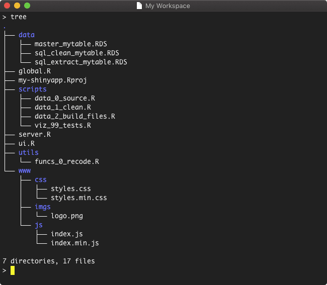

## Contents

1. [Project Structure](#project-structure)
    1. [Data](#data)
    2. [Scripts & utils](#scripts-utils)
2. [Terminal Functions](#terminal-functions)
3. [Notating Scripts](#notating-scripts)

<!-- endexcerpt -->

<span id="project-structure"/>

## Project Structures 

Over the years, I developed a standard project structure that works well with my workflow. Let's take a look at a sample project structure.



On my desktop, I created a new project called "my-shinyapp" and I created a few sample files. In "my-shinyapp", I have a few child directories.

- `data/`: all data files used to prepare data for the shinyapp
- `scripts/`: all scripts used to source and prepare data for the shinyapp, as well as visualization tests
- `utils/`: a place for functions used shinyapp or during the data sourcing process
- `www/`: all assets used in the shinyapp (imgs, css, js, etc.).

These are the most common folders in my projects. If the app calls for any other javascript libraries, I will add them in `www/assets/`.

<span id="data"/>

### Data 

All datasets that are used in the app are placed in the `data` folder. I try to follow a standard naming convention that indicates the data source and stage of the data cleaning process. 

For example, if my shinyapp uses data from a sql database, I will start by writing the results from the main query to an rds file and give the file a meaningful name. 

```r
saveRDS(results, "data/sql_mytable_raw.RDS")
```

As the data is cleaned, I will create a new file and assign a name that resembles that reflects the current status. For example, if the data is cleaned or summarized.

```r
saveRDS(cleaned, "data/sql_mytable_clean.RDS")
saveRDS(summarized, "data/sql_mytable_summarized.RDS")
```

This is approach is helpful as I always have a local copy of the original data source and all of the preparation stages. This eliminates the need to fetch the data each time I need to make a changes to the cleaning process. This approach saved me from delays at work when a server upgrade caused everyone to lose access to the database. It took a few days until it was fixed, but I was able to keep working using the local files and refresh the data when the server was back online.

<span id="scripts-utils"/>

### Scripts & Utils

In `scripts/`, I will create all the files needed to prepare the master dataset for the shinyapp (`.R`, `.sql`, etc.). All helper functions are stored in `utils/`. I alway prefix these files with `data_*` and create a new file for each step. Most projects will the following files:

- `data_0_source.R`: pull data from the source
- `data_1_clean.R`: clean the data
- `data_2_transform.R`: reshape the data into the desired format
- `data_3_merge.R`: prepare data and write master dataset

<span id="terminal-functions"/>

## Terminal Functions

I like to work through the terminal and I created a two bash functions to initialize shinyapp projects and `.Rproj` files. The function `init-rproj` creates the `.Rproj` file using the name of the current directory. The function `init-shinyapp` creates the defaults folders and commonly used files (`ui.R`, `global.R`, `server.R`). By default, the `init-shinyapp` function initiates the `init-rproj` function so you do not need to run this command separately. 

Here are the functions.

```bash
# init-rprojs
# define a function that initializes an .Rproj file using the name of the current directory
function init-rproj() {

    # get current pwd and get 'basename'
    rproj="$PWD"
    rproj="${rproj##*/}.Rproj"

    # init file
    touch $rproj

    # write configs to file
    printf "Version: 1.0\n\n"  >> $rproj
    printf "RestoreWorkspace: Default\n" >> $rproj
    printf "SaveWorkspace: Default\n" >> $rproj
    printf "AlwaysSaveHistory: Default\n" >> $rproj
    printf "\n" >> $rproj
    printf "EnableCodeIndexing: Yes\n" >> $rproj
    printf "UseSpacesForTab: Yes\n" >> $rproj
    printf "NumSpacesForTab: 4\n" >> $rproj
    printf "Encoding: UTF-8\n" >> $rproj
    printf "RnwWeave: Sweave\n" >> $rproj
    printf "LaTeX: pdfLaTeX\n" >> $rproj

    # display message
    echo Created: $rproj
}

# init-shinyapp
# define a function that makes default folders and files
function init-shinyapp() {

    # create dirs
    mkdir data scripts utils www www/css www/js www/imgs

    # create starter files
    touch ui.R server.R global.R
    touch www/css/styles.css www/js/index.js

    # create .Rproj
    init-rproj

    # echo message
    echo "Complete"

}
```

To use this function, copy these functions into your `.bashrc` or `.bash_profile` file. These config files are located in your home directory. Type the following commands to find edit the files. The terminal will need to be restarted in order to the function to be executable.

```bash

# cd to $HOME
cd $HOME

# list files to confirm the file is there
ls -a

# open file in nano (depending on which you are using)
nano .bashrc
nano .bash_profile

# or open in your text editor
open -a "your_text_editor_here" .bash_profile

```
 To run, type the following:

```bash

# cd to desired location
cd path/to/dir/

# create new project
mkdir myshinyapp
cd myshinyapp

# init project
init-shinyapp
# Created: myshinyapp.Rproj
# Complete
```

<span id="notating-scripts"/>

## Notating Scripts

A lot of these workflows are based on personal preference and what works well with work projects. I use quite a few snippets and most of these are for notating scripts. My favorite notation snippet is `headerDefault`.

`headerDefault` inserts a template for me to fill out. This includes the name of the file, author (usually my name), general purpose of the script, required packages and dependencies, and current status (I usually use "in.progress", "working; complete", or "archived"), as well as writing any notes for me or my collaborators. 

Here's what `headerDefault` produces.

```r
#'//////////////////////////////////////////////////////////
#' FILE: 
#' AUTHOR: 
#' CREATED: 16 April 2019
#' MODIFIED: 16 April 2019
#' PURPOSE: 
#' PACKAGES: 
#' STATUS: 
#' COMMENTS: 
#'//////////////////////////////////////////////////////////
#' GLOBAL OPTIONS:
options(stringsAsFactors = FALSE)
```

The dates are rendered using the following code.

```r
 `r format(Sys.Date(),"%d %B %Y")`.
```

I've found this snippet to be critical for a lot of projects as I store my code in many places (dropbox, shared network servers, github, or other cloud services) and I access these files from different machines. It can be months since I last opened a file and I cannot always tell what a script does from the name alone. This header informs me of what the script does, are there any required packages, and other information I need in order to run the script.

Let's see this snippet in action!


You can sync your snippets across machines using the [snippr](https://github.com/dgrtwo/snippr) package.

Here's the full snippet -

```r
snippet headerDefault
	#'//////////////////////////////////////////////////////////////////////////////
	#' FILE: ${1}
	#' AUTHOR: ${2}
	#' CREATED: `r format(Sys.Date(),"%d %B %Y")`
	#' MODIFIED: `r format(Sys.Date(),"%d %B %Y")`
	#' PURPOSE: ${3}
	#' PACKAGES: ${4}
	#' STATUS: ${5}
	#' COMMENTS: ${6}
	#'//////////////////////////////////////////////////////////////////////////////
	#' GLOBAL OPTIONS:
	options(stringsAsFactors = FALSE)
	${7}
```
