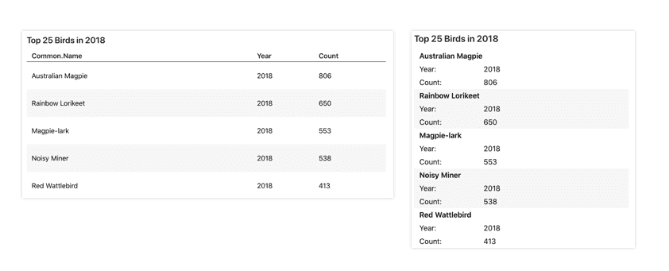

## Contents

1. [Why would I need this?](#about)
2. [How does this shiny app work?](#work)
    1. [Creating a render datatable function](#work-function)
        1. [Building the table headers](#work-function-headers)
        2. [Building the table body](#work-function-body)
        3. [Building the table function](#work-function-main)
    2. [Preparing the shiny app](#work-app)
    3. [Writing the CSS styles](#work-styles)
3. [What do I need to know before implementing this into my own application?](#further-considerations)
4. [How do I run the example application?](#run)

<span id="about" />

## Why would I need this?

Data tables are a good method for displaying data on the web. However, this can lead to issues of content overflows on mobile devices or if the browser is resized. Using relative units (i.e., %, em, etc.), it's possible to resize the table depending on the window size, but this may result in the text overflowing to neighboring cells or becoming too small to read. This is where building responsive tables can help. Instead of resizing the table, it is better to reorganize the content. For example, it is possible to stack cells as opposed to displaying them in a row. 

Consider the the following figure. In the figure below, the table on the left presents the table in a normal row-by-column layout. The figure on the right shows the same data, but each column is stacked and the first column now acts as a table header.  



Both tables are use the same data and use html and css to develop. The format changes only when size of the browser is smaller than a predefined breakpoint. In this tutorial and in the example application, we will learn how to create this table for use in a shiny application.

Originally, this example application was built to solve an issue in another project. However, it was further developed in response to the following R community [post](https://community.rstudio.com/t/create-accessible-html-tables-in-rstudio/46831).

<span id="work" />

## How does this shiny app work?

It might be possible to use existing packages to create a responsive table, but that might involve overriding css styles or modifying existing render methods which could lead to other issues. Instead, it would be easier to create our own render datatable function to produce a structure that allows us to make a responsive table using CSS.

In this section, I will walk you through all of the steps required to produce a simple, responsive table. This includes the following.

1. Creating a render datatable function
2. Preparing the shiny app
4. Writing the CSS styles

<span id="work-function" />

### Creating a render datatable function

Before we write the data table function, it is important to map the flow of data to html output. Here is what we will need to consider when writing the function. 

1. **Determine the HTML elements:** The primary elements of a table are the header (`<thead>`), the body (`<tbody>`), rows (`<tr>`), and cells (either `<th>` for headers and `<td>` for everything else). In shiny, these elements can be accessed through `tags$*` (`tags$thead`, `tags$td`, etc.). For more information table structures, please see the [HTML Table Basics](https://developer.mozilla.org/en-US/docs/Learn/HTML/Tables/Basics) guide and refer to the [table specs](https://developer.mozilla.org/en-US/docs/Web/HTML/Element/table).
2. **Create an outline of the function:** We will need to figure out a way to generate the headers using the column names and render the values in our dataset into HTML cells. In this case, it will likely be easier to write a primary function and two helper functions (one for building the body and one for building the header). The primary function will act as a wrapper around the two helper functions.
3. **Bind data to html elements for use in CSS:** the way this approach works is by rendering column names in `<span>` elements in each cell. This allows us to use css [media queries](https://developer.mozilla.org/en-US/docs/Web/CSS/Media_Queries/Using_media_queries) to display (or hide) this information when the window is resized.
4. **Provide a method for configuring rendering of the table:** in some cases, you may not want to have responsive tables. If this is the case, there should be an option to turn off the rendering of the table for responsivity. Other options (html escape, controlling row headers, etc.) should also be added and processed in the handler functions. 

The options that will be used in the function are listed below and are defined in the parent function.
- `responsive`: setting to true will render the required elements for responsive tables
- `rowHeaders`: setting to true will render the first cell of each row as a row header. This is recommended to use if all values in each row are related and have a specific value that describes the row (e.g., study participant data)
- `asHTML`: setting to true allows cell content to render any html in the cell. This may be useful if you want to add line breaks, urls, or other inline elements.

This will make sense as we start writing the functions and the css. Let's start writing the function.

<span id="work-function-header" />

#### Building the table header

The first helper function will generate the table header element using the column names of the input dataset. The function will also process options from the parent function. 

First, I will start by defining the function. I'll call the function `build_header` and assign two arguments: `data` and `options`. The `options` argument is a list of options passed through in the parent function.

```r
build_header <- function(data, options){
    ...
}
```

Second, pull the names of the columns of the input dataset using the colnames function. 

```r
build_header <- function(data){
    columns <- colnames(data)
    ...
}
```

Next, we will create the cells for the table header. Since we want the function to respond the dimensions of the column names, I will used the `lapply` function to iterate over all columns. This will return a collection of cells (`<th>`). 

```r
build_header <- function(data){
    columns <- colnames(data)
    cells <- lapply(1:length(columns), function(n){
        ...
    })
    ...
}
```

Next, the function will evaluate the options argument in order to render cell content. Specifically, should the cell value be rendered as a string or as an html element? Since the html markup for all column headers is identical (`<th>`), the condition will return the cell value with or without escaping html. The option that will be used in the condition `asHTML`. The options object is a list and the value `asHTML` can be accessed using `options$asHTML`. 

```r
build_header <- function(data){
    columns <- colnames(data)
    cells <- lapply(1:length(columns), function(n){
        if (isTRUE(options$asHTML)) {
            cell_value <- htmltools::HTML(columns[n])
        } else {
            cell_value <- columns[n]
        }
        ...
    })
    ...
}
```

Once the cell value (i.e., column name) is rendered, it can now be added to column header element which is `<th>` and returned.

 ```r
build_header <- function(data){
    columns <- colnames(data)
    cells <- lapply(1:length(columns), function(n){
        if (isTRUE(options$asHTML)) {
            cell_value <- htmltools::HTML(columns[n])
        } else {
            cell_value <- columns[n]
        }
        cell <- htmltools::tags$th(scope = "col", cell_value)
        cell
    })
    ...
}
```

The `scope` is used for improving the accessibility of tables with ambiguous data. This attribute creates a link between the table cells and the column they are associated with. This allows screen readers to provide more useful information when reading the data aloud. For example, if the user is on line 10 of a dataset, it will the screen reader will say, "row 10 of n, *name of column*, *value*" (where *n* is the total number of rows; *name of column* is the column name of a cell; *value* is the value of a cell).


At this point, the object cells is as it sounds, a collection of cells. Before the cells are added to the table, they will need to be wrapped in a row element (`tr`) and then in the table header element (`thead`).

```r
build_header <- function(data){
    columns <- colnames(data)
    cells <- lapply(1:length(columns), function(n){
        if (isTRUE(options$asHTML)) {
            cell_value <- htmltools::HTML(columns[n])
        } else {
            cell_value <- columns[n]
        }
        cell <- htmltools::tags$th(scope = "col", cell_value)
        cell
    })
    htmltools::tags$thead(
        htmltools::tags$tr(role = "row", cells)
    )
}
```

The `role` attribute is added for good accessibility practice. This attribute is important should the css display properties of table elements are changed. This will ensure screen readers still interpret rows correctly.

Let's test the function using the `iris` dataset.

```r
build_header(iris, options = list(responsive = TRUE, rowHeaders = TRUE, asHTML = FALSE))
```

This function yields the following html markup.

```html
<thead>
  <tr role="row">
    <th scope="col">Sepal.Length</th>
    <th scope="col">Sepal.Width</th>
    <th scope="col">Petal.Length</th>
    <th scope="col">Petal.Width</th>
    <th scope="col">Species</th>
  </tr>
</thead>
```

<span id="work-function-body" />

#### Building the table body

The function that is used to build the table body is structured a bit different than the header function. To generate the html output, the function will render the table body by rows and columns. This means that we must take the first row in our dataset, build each cell, and add the cells to a row and then repeat this process for row two, row three, and so on. The function will also have conditions for processing the list of options, but this will be added a little later.

First, define the function. I will call this function `build_body` and it will have two input arguments `data` and `options` (received from the parent function).

```r
build_body <- function(data){
    ...
}
```

Second, to get the function to iterate row and column we will use a nested lapply function. The outer lapply function will process all rows and output them to a single object `body`. The inner lapply function will generate all cells (in a similar manner as the `build_header` function). To calculate number of iterations to use (i.e., rows and columns), I will use `1:NROW(data)` and `1:NCOL(data)`. I have also used the input arguments `row` and `col` to make it clear how the values are rendered into html elements.

```r
build_body <- function(data){
    body <- lapply(1:NROW(data), function(row){
        cells <- lapply(1:NCOL(data), function(col){
            ...
        })
        ...
    })
    ...
}
```

To generate the cells, the function will do a couple of things. 

1. Render the cell content based on the option `asHTML`.
2. Render the html element as based on the option `rowHeader`
3. Add cell content to the html element based on the option `responsive`.

The rationale for structuring the cells in this way is that when the screen is smaller than a desktop or if the window is resized, then the table is collapsed and the cells are stacked. Another way to look at this is if the transformed from wide to long using either the `t()` function in base R or the `gather()` function from dplyr.

Here is a example of what it happening using some sample data. The sample dataset included in the example app has the 2017 and 2018 reporting rates for Australian birds in the Birds in Backyards survey program. The data is structured in long format where each row is the number of birds reported for a species for a given year. The columns are name, year, and count. Here is the first row in the dataset presented in the normal layout and in the responsive layout.

**Datatable: Normal**

In the normal layout, the table is presented by columns and rows.

```
| Common.Name          | Year | Count
| Australasian Figbird | 2017 | 133
```

**Datatable: Responsive**

In the responsive format, the column names and values are collapsed into a single cell and cells are stacked.

```
| Australasian Figbird |
| year: 2017           |
| count: 133           |
```

The first step is to evalue the option `asHTML`.

```r
build_body <- function(data){
    body <- lapply(1:NROW(data), function(row){
        cells <- lapply(1:NCOL(data), function(col){

            # asHTML
            if (isTRUE(options$asHTML)) {
                cell_value <- htmltools::HTML(data[row, col])
            } else {
                cell_value <- data[row, col]
            }
            ...
        })
        ...
    })
    ...
}
```

Next, using the option `rowHeader`, each cell can be built. It is important to note that if you are using this option, the data should be reorganized so that the row headers are first. Otherwise, it would not make a lot sense for individuals using screen readers.

```r
build_body <- function(data){
    body <- lapply(1:NROW(data), function(row){
        cells <- lapply(1:NCOL(data), function(col){

            # asHTML
            if (isTRUE(options$asHTML)) {
                cell_value <- htmltools::HTML(data[row, col])
            } else {
                cell_value <- data[row, col]
            }

            # rowHeaders
            if (isTRUE(options$rowHeaders) && col == 1) {
                cell <- htmltools::tags$th(role = "rowheader")
            } else {
                cell <- htmltools::tags$td(role = "cell")
            }
            ...
        })
        ...
    })
    ...
}
```

Now that the cell markup is define, the function will add content to the cell based on the option `responsive`. If set to TRUE, this will return the current column name in a span element that is hidden/shown based on screen size. The span element will also have the attribute `aria-hidden="true"` as the span element is for visual purposes only. Once all conditions are evaluated, the cell is returned.

```r
build_body <- function(data){
    body <- lapply(1:NROW(data), function(row){
        cells <- lapply(1:NCOL(data), function(col){

            # asHTML
            if (isTRUE(options$asHTML)) {
                cell_value <- htmltools::HTML(data[row, col])
            } else {
                cell_value <- data[row, col]
            }

            # rowHeaders
            if (isTRUE(options$rowHeaders) && col == 1) {
                cell <- htmltools::tags$th(role = "rowheader")
            } else {
                cell <- htmltools::tags$td(role = "cell")
            }

            # responsiveness
            if (isTRUE(options$responsive)) {
                cell$children <- list(
                    htmltools::tags$span(
                        class = "hidden-colname",
                        `aria-hidden` = "true",
                        colnames(data)[col]
                    ),
                    cell_value
                )
            } else {
                cell$children <- list(
                    cell_value
                )
            }

            # return cell
            cell
        })
        ...
    })
    ...
}
```

At this point, the object cells is a collection of just that, cells. To add the cells to the table, they need to be returned in the row element `tr`.

Lastly, the object `body` is a collection of rows and the rows need to be added to the body element of the table. This means we will wrap the rows in the element `tbody` and return the output.

Here is the final function.

```r
build_body <- function(data){
    body <- lapply(1:NROW(data), function(row){
        cells <- lapply(1:NCOL(data), function(col){

            # asHTML
            if (isTRUE(options$asHTML)) {
                cell_value <- htmltools::HTML(data[row, col])
            } else {
                cell_value <- data[row, col]
            }

            # rowHeaders
            if (isTRUE(options$rowHeaders) && col == 1) {
                cell <- htmltools::tags$th(role = "rowheader")
            } else {
                cell <- htmltools::tags$td(role = "cell")
            }

            # responsiveness
            if (isTRUE(options$responsive)) {
                cell$children <- list(
                    htmltools::tags$span(
                        class = "hidden-colname",
                        `aria-hidden` = "true",
                        colnames(data)[col]
                    ),
                    cell_value
                )
            } else {
                cell$children <- list(
                    cell_value
                )
            }

            # return cell
            cell
        })

        # return cells in row
        htmltools::tags$tr(role = "row", cells)
    })

    # return rows in body
    htmltools::tags$tbody(body)
}
```

Let's test the function using the first row of the `iris` dataset. 

```r
build_body(iris[1,], options = list(responsive = T, rowHeaders = T, asHTML = F))
```

This would return the following html markup.

```html
<tbody>
  <tr role="row">
    <th role="rowheader">
      <span class="hidden-colname" aria-hidden="true">Sepal.Length</span>
      5.1
    </th>
    <td role="cell">
      <span class="hidden-colname" aria-hidden="true">Sepal.Width</span>
      3.5
    </td>
    <td role="cell">
      <span class="hidden-colname" aria-hidden="true">Petal.Length</span>
      1.4
    </td>
    <td role="cell">
      <span class="hidden-colname" aria-hidden="true">Petal.Width</span>
      0.2
    </td>
    <td role="cell">
      <span class="hidden-colname" aria-hidden="true">Species</span>
      1
    </td>
  </tr>
</tbody>
```

<span id="work-function-main" />

#### Building the table function

Now that the two helper functions are written, they can be used to create the main function. This function will generate the table body and header, as well as a caption (or title for the table) all using the list of options. For simplicity, I have named this function `datatable` and have defined the following input arguments. 

- **data**: the object containing the data that you want to be rendered as an html table.
- **id**: a unique ID to be applied to the table element. This is optional, but recommended if you are rendering more than one table on the same page using this function.
- **caption**: an title to render with the table (optional).
- **options**: a list of options, `options = list(...)`
    - `responsive`: a logical arg for turning on/off the rendering of additional elements for responsive tables (i.e., span; default = FALSE)
    - `rowHeaders`: a logical arg that renders the first cell of every row as a row header. This is useful for datasets where all data in a row is related, e.g., patient data. If set to TRUE, the data must be organized so that the row header is the first column.
    - `asHTML`: a logical argument used to render cell text as html elements (default = FALSE)

First, I have defined the function and the input arguments, as well as built the table header and table body using the input data.

```r
datatable <- function(data, id = NULL, caption = NULL, options = list(responsive = TRUE, rowHeaders = TRUE, asHTML = FALSE)) {

    # render table and table elements
    tbl <- htmltools::tags$table(class = "datatable",
        datatable_helpers$build_header(data, options),
        datatable_helpers$build_body(data, options)
    )

    ...
}
```

Next, if an id is supplied, the table attributes will need to be updated.

```r
datatable <- function(data, id = NULL, caption = NULL, options = list(responsive = TRUE, rowHeaders = TRUE, asHTML = FALSE)) {

    # render table and table elements
    tbl <- htmltools::tags$table(class = "datatable",
        datatable_helpers$build_header(data, options),
        datatable_helpers$build_body(data, options)
    )

    # add id
    if (!is.null(id)) {
        tbl$attribs$id <- id
    }
}
```

The last step in the function evaluates if a caption should be added to the table. Captions are typically placed after the opening table tag so this would would effect how sub-elements, or children, are added to the parent element (table); an if statement can handle this. Child elements can be added to an html element using `tbl$children`. Since these are html outputs, all child elements are added as a list. 

Here is the final function.

```r
datatable <- function(data, id = NULL, caption = NULL, options = list(responsive = TRUE, rowHeaders = TRUE, asHTML = FALSE)) {

    # render table and table elements
    tbl <- htmltools::tags$table(class = "datatable",
        datatable_helpers$build_header(data, options),
        datatable_helpers$build_body(data, options)
    )

    # add id
    if (!is.null(id)) {
        tbl$attribs$id <- id
    }

    # should a caption be rendered?
    if (!is.null(caption)) {
        tbl$children <- list(
            htmltools::tags$caption(caption),
            tbl$children
        )
    }

    # return
    tbl
}
```

Let's test the function using the first row of the iris dataset.

```r
datatable(data = iris[1,], id="iris", caption = "Iris Dataset")
```

This would yield the following markup.

```html
<table class="datatable" id="datatable-iris">
  <caption>Iris Dataset</caption>
  <thead>
    <tr role="row">
      <th scope="col">Sepal.Length</th>
      <th scope="col">Sepal.Width</th>
      <th scope="col">Petal.Length</th>
      <th scope="col">Petal.Width</th>
      <th scope="col">Species</th>
    </tr>
  </thead>
  <tbody>
    <tr role="row">
      <th role="rowheader">
        <span class="hidden-colname" aria-hidden="true">Sepal.Length</span>
        5.1
      </th>
      <td role="cell">
        <span class="hidden-colname" aria-hidden="true">Sepal.Width</span>
        3.5
      </td>
      <td role="cell">
        <span class="hidden-colname" aria-hidden="true">Petal.Length</span>
        1.4
      </td>
      <td role="cell">
        <span class="hidden-colname" aria-hidden="true">Petal.Width</span>
        0.2
      </td>
      <td role="cell">
        <span class="hidden-colname" aria-hidden="true">Species</span>
        setosa
      </td>
    </tr>
  </tbody>
</table>
```

<span id="work-app" />

### Preparing the shiny app

In a shiny applicaiton, the function can be used as any other server output. Since the output of the function is a shiny tags list, it should be rendered used `renderUI` and added to the server output.

```r
# server.R
output$tbl <- renderUI({
    datatable(data = iris, id = "iris", caption = "Iris Dataset")
})
```

Then, on the client side, create the corresponding `uiOutput`.

```r
# ui.R
uiOutput("tbl")
```

<span id="work-styles" />

### Writing the CSS styles

 Using [media queries](https://developer.mozilla.org/en-US/docs/Web/CSS/Media_Queries/Using_media_queries) and [pseudo-elements](https://developer.mozilla.org/en-US/docs/Web/CSS/Pseudo-elements), the column name is displayed before the value of a cell only when the screen width is less than a maximum value. In this example, I'm using `892px` as a break point. This breakpoint is completely arbitrary. I typically choose breakpoints around `900px`, but the final point depends on the table structure and the cell content. Choose a number and see how the table looks when the screen is resized and adjust as necessary. 

```css
@media (max-width: 892px){
    ...
}
```
 
In the datatable function, each cell (`td`) was given a span element that has the class `hidden-colname`. In a css file, the properties associated with this class will be modified to visually hide or display elements. 

Using the breakpoint `892px`, the following properties are used to visually display the column names and visually hide the table header when screen size is less than the `892px`. All cells and row headers (if present) are displayed as blocks.

```css
/* screens less than 892px */
@media (max-width: 892px){
    .datatable thead {
        position: absolute;
        clip: rect(1px 1px 1px 1px);
        clip: rect(1px, 1px, 1px, 1px);
        width: 1px;
        height: 1px;
        overflow: hidden;
    }

    .datatable tbody tr th,
    .datatable tbody tr td {
        display: block;
        padding: 5px 0 5px 12px;
    }

    .datatable .hidden-colname {
        display: inline-block;
        clip: auto;
        width: 150px;
        height: auto;
        line-height: 1;
    }
}
```

Outside of the media query, the properties for `hidden-colname` are different as we want the column names to be visually hidden when the screen is larger than `892px`. 

```css
.datatable .hidden-colname {
    display: inline-block;
    clip: rect(1px 1px 1px 1px);
    clip: rect(1px, 1px, 1px, 1px);
    width: 1px;
    height: 1px;
    overflow: hidden;
}
```

There are additional stylings in the css file. I will not discuss them here as they mainly set the style of other table elements. The block above is the most important block stylings for displaying the column names.

<span id="further-considerations" />

## What do I need to know before implementing this into my own application?

~~There are accessibility concerns when the table is transformed. For inviduals who use screen readers or other web assistive technologies, does the layout make sense and can the information be understood? Since the display properties of table elements are adjusted, it is likely that the screen readers will not treat the cells as standard table elements. It is likely that the cells will be interpreted as regular text elements. Adding additional attributes might help address this, but more research is required. Please keep this in mind when implementing this approach into your application. I will address this in the near future.~~

As of January 14th, the above concern has been largely addressed. Although, I'm still testing and making adjustments. I'm not quite ready to remove this item yet as it may be useful for future readers.

This approach provides a simple method for converting data to HTML tables. However, it is fairly basic in features. There is no support for more advanced layouts (i.e., nested tables, grouped columns or rows) as complex layouts are a difficult to make accessible. As this function was originally intended to address an issue for a work project, I did not have a need for complex layouts and other rendering options. Although, it is likely that I will need this in the near future. Stay tuned for future updates! 

> This example has led to the begining of an accessible components library for shinyapps. There have been a number of updates to the function (performance and features) that may be useful for developing and customizing tables in shiny apps. Check it out the [accessibleshiny](https://github.com/davidruvolo51/accessibleshiny) package. 

## How do I run the example application?

The demo can be run by cloning the [shinyAppTutorials](https://github.com/davidruvolo51/shinyAppTutorials) respository and opening the responsive data tables R project file or you can run the following code from within R studio.

```r
install.packages(shiny)
shiny::runGitHub(repo = "shinyAppTutorials", username = "davidruvolo51", subdir="responsive-datatables")
```

I would also checkout the tutorial [Using SASS in Shiny](../sass-in-shiny/) where I recreate this application using sass.