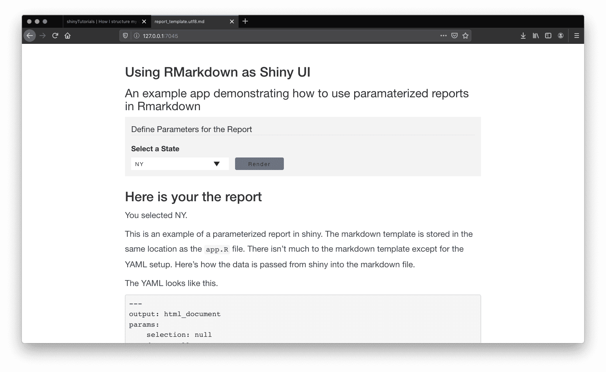

## Contents

1. [Why would I need this?](#about)
2. [How do I get this working?](#work)
    1. [Preparing the UI](#work-ui)
    2. [Drafting your Rmarkdown template as a parameterized report](#work-template)
    3. [Rending the template server-side](#work-render)
3. [Further Thoughts](#further-thoughts)
4. [How do I run the example?](#run)

<!-- endexcerpt -->

<span id="about"></span>

## Why would I need this?

Rmarkdown is useful tool for generating data-driven documents in the R environment. Given that markdown documents can be rendered to several formats (html, docx, etc.), you can use `.Rmd` files as a substitute for shiny UIs. In other words, you can write in Rmarkdown and let the shiny server render your file(s) into HTML documents. This can be a good approach if you want to turn a report into a shiny app or if you want to speed up the development phase of your shiny apps. Alternatively, you may want to use flexdashboards.

The [data](https://github.com/fivethirtyeight/data/tree/master/librarians) used in this app comes from 538's article titled, [Where are America's Librarians](https://fivethirtyeight.com/features/where-are-americas-librarians/). I have a local copy of the data which can be updated by running the script `scripts/data_0_source.R`. On a side note, I prefer to work with a local copy of a dataset or other dependency. This limits the number of external requests that are made at the begining of the app which may result in slow startup times. 

The purpose of this app is to create a shiny app that allows users to make a selection, transform data based on that selection, and then render and display a report using the transformed data. The dataset is grouped by state (variable: `prim_state`). In this example, we will create a select input element that will allow us to filter the data by state, and then render a report using the state level data. Here's the application we will create.



Let's get started!

<span id="work"></span>

## How do I get this working?

The beauty of this approach is that your can write your UI using good ole Rmarkdown. In terms of the shiny UI, there isn't much to do unless you want to have inputs and other elements besides the report. To get the app running, this tutorial will cover three steps.

1. Prepare the UI
2. Draft a rmarkdown template as a parameterized report
3. Write a render function that compiles the template 

This app will demonstrate how to render a report based on user selection.

<span id="work-ui"></span>

### Preparing the UI

In the data, there is a grouping variable `prim_state`. We will use the distinct values (which are state abbreviations) in this column and render them in the select input. This will allow the user to generate a report on the state level. 

I decided to go the custom route with my select inputs (personal preference), feel free to use any method that you like. I've applied some styling as well. The stylings can be found in `www/css/styles.css`.

The select input must have two elements: `tags$label()` element and the input element `tags$select()`. We will also render each distinct state name as the html element `<option>` and order the states alphabetically. 

We will need a button to trigger the rendering of the report as well. For good accessibility and semantic HTML practices, these elements will be wrapped in an form element and given a legend.

Here's how the form is coded. 

```r
# build form
tags$form(

    # set form legend
    tags$legend("Define Parameters for the Report"),

    # set label
    tags$label(`for`="id", "Select a State"),

    # define the select input element
    tags$select(id="state", 

        # return as html
        HTML(

            # set default selected option
            c("Select a State",

                # wrap each distinct value as: <option value="prim_state">prim_state</option>
                sapply(

                    # pull unique values and order them
                    sort(unique(librarians$prim_state)),
                    function(x){

                        # build html object
                        paste0("<option value='",x,"'>",x, "</option>")
                    }
                )
            )
        )
    
    ),

    # button
    tags$button(id="render", class="action-button shiny-bound-input", "Render")
)
```

Before we move on, we will need to create one final element and that is where we want our report to be rendered into. Use the `htmlOutput` function in the ui and set a unique id for the output from the server. I'm going to call this "report" for simplicity.

```r
htmlOutput("report")
```

See the `app.R` file for the full ui code.

<span id="work-template"></span>

### Drafting your rmarkdown template as a parameterized report

In your project directory, create a new Rmarkdown file. This file will serve as the template for the app for which we will pass data into.

Before we get started writing our template, it's a good idea to think about what we might want to use. So, what do we want to use in our markdown template? How do we define this in the template? 

Most importantly, we need some data so we will create a `data` parameter that receive an object from our sever. It would also be helpful to print the user's selection somewhere in the report so we will add a param `selection`. 

Any parameters that you want to access in the shiny server and in the Rmarkdown template must be defined in the YAML through the `params` property. Each param is declared on a new line and given an initial value.  Here's how to write the `data` and `selection` params.

```
---
output: html_document
params:
    data: null
    selection: null
---
```

I'm setting each param to `null` as a default value. Depending on your setup (if you want the app to render the template on load), you may want to set default values.

Take a look at the output format. The output format is set to `html_document` as we want to shiny to render our template as an html file (this will create a `.html` file in our directory) and then load it into our UI. Continue adding as params (if needed) and add other YAML properties as needed.

With our parameters defined, we can access them in the report inline using...

```r
`r params$selection`
```

Or in code chunks. 

```r
x = params$data
print(x)
```

Now that we have our parameters defined, let's finish writing our template. In this example, we want to create a basic report that summarizes the top 10 areas where librarians are located and we also want to display the data in a table. First, let's create a top 10 object (note where the reference to params is located).

```r
# top 10 summary
top_ten <- params$data %>%
    group_by(area_name) %>%
    summarize("tot_emp" = sum(tot_emp)) %>%
    top_n(10) %>%
    arrange(tot_emp) %>%
    mutate(area_name = factor(area_name, area_name))
```

Now that we have our summarized object, we can create our chart and table using the object `top_ten` as we would with any other data object.

```r
# plot top 10 areas by selected state
ggplot(data = top_ten, aes(x = area_name, y= tot_emp)) + 
    geom_col() +
    coord_flip() + 
    ggtitle("Which states have the most employed librarians?") + 
    labs(x = NULL, y= "Total Employed") + 
    theme_minimal()
```

We will use the `kableExtra` package to render a data table.

```r
# render a data table using the kableExtra package
kableExtra::kable(top_ten) %>% kable_styling()
```

That's the basics for the Rmarkdown template! You can create many more visualizations as you like. Just remember to reference the `params$your_param_name_here` each time.

<span id="work-render"></span>

### Rendering the template server-side

The last thing that we will write is our render function. Since we want the report to render when the button is clicked, we will start off be writing everything in an `observeEvent`. 

```r
observeEvent(input$render, {
    # do something here
})
```

In terms of passing data to your markdown template, you have a few options. You can either: 

1. prep the data in the shiny server code or 
2. pass the dataset to the markdown report and filter it there. 

I'm not sure if there's a difference between the two approaches. There might be performance issues. I would hypothesize that passing large datasets to our markdown template, and then rendering them would take longer than filtering the data in the shiny server. If you have other outputs that depend on the filtered data, then you may want to do all filtering through the server. Since this app is pretty simple, I'll prep the data in the render function.

Now, we will write a simple filter that filters our dataset `librarians` using the selected value from our select input. We can use base R for this. I'll call this `librarians_filtered` for now.

```r
librarians_filtered <- librarians[librarians$prim_state == input$state, ]
```

\***NOTE**: the object `librarians` is loaded at the top the file. 

```r
librarians <- readRDS("data/librarians_538.RDS")
```

Next, we will define our output method to tell shiny what we want to send to the ui and where. In our ui, we created the `htmlOutput("report")` element. We will reference that here and send our ui via the `renderUI` function to the report element.

```r
observeEvent(input$render, {

    # filter data
    librarians_filtered <- librarians[librarians$prim_state == input$state, ]

    # output
    output$report <- renderUI({
        # do something here
    })
})
```


Let's focus on `output$report`. What we want to do here is to return an html file that was rendered from our Rmarkdown template. We will also pass the data from the server to the params that we defined in the yaml (`params$data` and `params$selection`). We will use the `render` function from the `rmarkdown` package. This function has the argument `params` which allows us to send data to our template. 

Here's what the render function is written.

```r
rmarkdown::render(
    input="report_template.md", 
    params = list(selection = input$state, data=librarians_filtered)
)
```

The input is the path to the Rmarkdown template and we've passed the data as a list. We can call `input$state` directly and use `librarians_filtered` for the object that we defined above.

If you were to run the shiny app as is and render the report, you wouldn't see the report. That's because told shiny to render the template, but we haven't told shiny to load the rendered file. 

If we look back at our Rmarkdown template, we defined the output type in the yaml as "html_document". The easiest way to include the rendered doc is by wrapping our render function in the `includeHTML()` function.


```r
includeHTML(
    rmarkdown::render(
        input="report_template.md", 
        params = list(selection = input$state, data=librarians_filtered)
    )
)       
```

Now, let's put it all together.

```r
observeEvent(input$render, {

    # filter data
    librarians_filtered <- librarians[librarians$prim_state == input$state, ]

    # output
    output$report <- renderUI({
        includeHTML(
            rmarkdown::render(
                input="report_template.md", 
                params = list(selection = input$state, data=librarians_filtered)
            )
        )
    })
})
```

That's it. 

<span id="further-thoughts"></span>

## Further thoughts

You can create additional templates, render them accordingly, and pass as many parameters as you like. I haven't tested interactive visualizations in templates, but I would imagine they would work as long as you reference the correct `param`. 

Even though this is basic example, I've noticed that it takes a few seconds to render and load the template. The dataset is fairly small too. I would recommend preprocessing the data outside the markdown template (where possible). You can use loading animations and run them while the template is rendering. There are few loading ui packages on github. Search for `r shiny loading screen animations`.

Another thing I noticed when using parameterized reports in shiny applications, is that the it additional shared css files are loaded into the application (i.e., shiny dependencies). This may be an issue if you are using custom css as some styles will be overwritten or clash with the additional css files. To my knowledge, there doesn't seem to be a way to prevent the css files from loading. 

For more information on parameterized reports, check out the [documentation](https://rmarkdown.rstudio.com/developer_parameterized_reports.html%23parameter_types%2F).

<span id="run"></span>

## How do I run the example?

You can run this demo by cloning the [github repository](https://github.com/davidruvolo51/shinyAppTutorials) and opening the Rproject file in `rmarkdown-app` directory. Alternatively, you can run the app through the console using:

```r
install.packages(shiny)
shiny::runGithub(repo="shinyAppTutorials", username="davidruvolo51", subdir="rmarkdown-app")
```

Let me know if you have any questions.