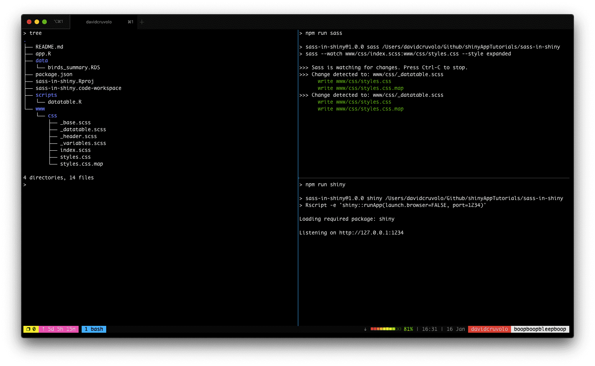

## Contents

1. [Why would I need this?](#about)
2. [How does this work?](#work)
    - [What is a CSS preprocessor and what does it do?](#work-about)
    - [Installing node, npm and sass](#work-install)
    - [Setting up your project directory](#work-project)
    - [Creating the package.json file](#work-file)
    - [Defining the build Scripts](#work-scripts)
        - [Adding a Shiny script](#work-scripts-shiny)
        - [Adding a Dev script](#work-scripts-dev)
        - [Using tmux](#work-scripts-tmux)
3. [What do I need to know before implementing this into my app?](#further-considerations)
4. [How do I run the example?](#run)

<!-- endexcerpt -->

<span id="about" />

## Why would I need this?

If your shiny applications have a lot styling or you have branding guidelines to follow, you may find that your projects have one large css file or that you are loading many css files in your app. A single css file can become difficult to manage and loading many files which can result in poor load times. The css file may also have outdated or unused css that may go unnoticed if there are hundreds or thousands of styles.

There are plenty of discussions and recommendations for best practices for writing css in the frontend space and these concepts can be applied to shiny app development. One recommendation that can greatly improve shiny app development is using a [css preprocessor](https://developer.mozilla.org/en-US/docs/Glossary/CSS_preprocessor). 

In this tutorial, I will provide a few steps for getting started with the css preprocessor [SASS](https://sass-lang.com/) in shiny applications. I will not focus so much on how to write scss, but more on how to set up sass. If you want to learn how to use sass, I would recommend starting with the official [documentation](https://sass-lang.com/documentation).

<span id="work" />

## How does this work?

This section will provide information on starting a new project and show how to integrate shiny and sass. This section will discuss the following.

1. Installing nodeJS, npm, and sass
2. Setting up your project directory
3. Creating the package.json file
4. Defining the build scripts

Before I dive into the tutorial, I'll provide some background on SASS. 

<span id="work-about" />

### What is a CSS preprocessor and what does it do?

What does a css preprocessor do exactly? CSS Preprocessors are an extension to css that allow you to write css with many helpful features such as nesting, modules, functions, variables, and much more. Behind the scenes, the CSS preprocessor are compiling your code into normal css. Let's take a look at an example. 

Let's say I have a section (`<section>`) that has a light background. Within the section, there is a heading (`<h2>`) and there are several paragraphs (`<p>`). We may want the paragraphs to be lighter in color than the section headings. Sometimes a paragraph may have a link (`<a>`) and the link must be red and also have a thick red underline. In addition to paragraphs, some sections may also have an image (``)that have a fixed width. Let's say that I want to set the width of the first image in each section to 300px. So, what would the css look like for all of these elements?

**Using CSS**

In css, you might write the styles in the following way.

```css
section {
    padding: 16px;
    background-color: #f6f6f6;
}

section h2 {
    font-size: 21pt;
    color: #252525;
}

section p {
    font-size: 16pt;
    color: #3f454b;
}

section p a {
    color: red;
    text-decoration: none;
    -webkit-box-shadow: inset 0 -2px 0 0 red;
    box-shadow: inset 0 -2px 0 0 red;
}

section img {
    width: 100px;
}

section img:first-child {
    width: 300px;
}
```

This is a simple example, but there are some things that could be improved and prep for future styles. For example, what if we wanted to use the link color in other places? It is possible to copy and paste the value where we need it, but what if you were to change the color again? It would be nice to assign the color to a variable which could be called anywhere we like. This would eliminate the need to update the values manually and may result in inconsistent color values.

What about the box shadow? Is there a better way to write it? `-webkit-` is a vendor prefix so that other browsers or older versions can interpret properties correctly. It would be nice if we could write this once.

The other issue is the way child elements are selected. Notice how all child elements start with `section`. It would nice if there was a way we could type this once. This may seem like it is not a major issue as this example is fairly small, but it can become difficult to manage when you are working with longer class names, when class names change, when there are many nested elements with child elements, adding in hover states, generating pseudo-elements, and much more.

**Using SCSS**

Let's rewrite this using the css preprocessor [SASS](https://sass-lang.com). There are a few [css preprocessors](https://developer.mozilla.org/en-US/docs/Glossary/CSS_preprocessor) available, but I will mainly focus on using sass; specifically, `.scss` files. You can use `.sass` files, but the indentation rules are hard to work with. I prefer `.scss` files as the syntax rules follow normal css.

Using the list of complaints above, here is how to address these issues using sass.

1. **Rewrite common values as variables:** In sass, variables are defined with `$variable_name: somevalue`. For example, let's say we want to specify the color blue `$blue: #5177b8;`.
2. **Use mixins to for box shadow:** Using SASS [mixins](https://sass-lang.com/documentation/at-rules/mixin), we can create a function that returns the css markup for a box shadow based on an input value. Mixins can be defined by using `@mixin mymixin($somevalue){ some-property: $somevalue }` and then used anywhere by using `@include mymixin("hello, world")`
3. **Use SASS Nesting:** The greatest thing about preprocessors is [nested selector paths](https://sass-lang.com/documentation/style-rules#nesting). This eliminates the need to type the same paths each time you want to style a child element. This is incredibly helpful when adding styles for hover states and for `nth` child rules.

Here is the same css, but rewritten using scss variables, mixins, and nested selectors.

```scss
// variables: colors
$heading-color: #252525;  // dark gray
$text-color: #3f454b;     // medium gray
$bg-color: #f6f6f6;       // light gray
$link-color: red;
$link-shadow: inset 0 -2px 0 0 $link-color;  // thick link underline

// mixin for boxshadow
@mixin box-shadow($value){
    -webkit-box-shadow: $value;
    box-shadow: $value;
}

// nested styles
section {
    padding: 16px;
    background-color: $bg-color;

    h2 {
        font-size: 21pt;
        color: $heading-color;
    }

    p {
        font-size: 16pt;
        color: $text-color;

        a {
            color: $link-color;
            text-decoration: none;
            @include box-shadow($link-shadow);
        }
    }

    img {
        width: 100px;

        &:first-child {
            width: 300px;
        }
    }
}
```

This may seem like more work, but it's much easier in the long run. Since scss allows for nested selectors, you do not need to write long selector paths. Let the preprocessor handle that. All values are rewritten as variables which can now be reused anywhere we want. If the values were to be changed, we do not need to worry about finding all instances of the value and changing them manually (say goodbye to `ctrl + f`).

Another advantage of using a preprocessor is that you now have a self contained module for section elements. You can save this above code into it's own file (e.g., `section.scss`) and then use it in other projects. When you view shiny apps as a series components and modules (even css), it makes the development process much easier resulting in consistent UI across applications. This approach is useful when you are developing multiple applications for an organization that has strict branding guidelines. 

<span id="work-install" />

### Installing Node, Npm, and SASS

Let's focus on getting sass working with shiny. You will need to install a few tools to do so: nodejs, npm, and sass. 

First, we will install node and npm. Npm and Node are installed together so visit the [nodejs downloads page](https://nodejs.org/en/download/) and download the latest installer. If you aren't sure if you have these tools installed or would like to confirm that they were installed correctly, run the following commands.

```bash
npm -v
node -v
```

Each command will print the verison number. If no errors are thrown, then you can install SASS using npm.

```bash
npm install -g sass
```

To confirm the installation of SASS, run the following command.

```bash
sass -v
```

If you encounter any errors installing these tools, visit the official installation documentation for more information.

- [Installing nodejs and npm](https://docs.npmjs.com/downloading-and-installing-node-js-and-npm)
- [SASS installation page](https://sass-lang.com/install)

<span id="work-project" />

### Setting up your project directory

In your shiny project, create the `www` folder and a subfolder which will be used to place all the sass files. I'm calling the subfolder `css` for simplicity.

```
myshinyapp /
    + www /
        + css /
```

Next, create the desired scss files. My preferred method is to have a master sass file (I am naming `index.R`), several component-based files, and a variables file. Each component-based file contains the styles for a specific element such as a navigation bar, the footer of an app, or an input widget. I use the variables file to define the app's color palette, font sizes, or other values that may be used in other components. I use the master sass file to load all component-base files and write styles for specific elements. I like this approach as it is easier to manage several smaller files than one large file. Most of my projects will have a variation of the following structure.

```bash
css /
    _base.scss          # similar to normalize.css
    _dropdown.scss      # for a dropdown menu
    _footer.scss        # page footer
    _navbar.scss        # navigation bar
    _page.scss          # all page content (i.e., within <main> and <section>)
    _variables.scss     # colors, font sizes, etc.
    index.scss          # load all other files and one off styles
``` 

<span id="work-file" />

### Creating the package.json file

Next, create a package.json file. This file contains information about your application such as author, app description, licenses, list of dependencies, build scripts, and more. You can create this file in the terminal using the following command.

```bash
npm init
```

This will present a handful of prompts where you can enter information about the project. Some information may be found automatically and some questions have default values. This process should take a minute or two. If you do not know, you can always edit the file later.

<span id="work-scripts" />

### Defining the build scripts

Now that the package.json file, is created we can add a few build scripts. For example, starting the shiny server and starting sass. We can create an alias for a command so we do not have to type it over again. 

In the package.json file, there is an entry called "scripts". There may already be entry for `tests` which can be remove if you do not have any test scripts to run. On a new line, we will create a new script for starting the sass server. The syntax for the sass command is `sass --watch input:output`. In the section "Setting up your project directory", we created a master scss file called `index.scss`. This is the entry point that sass will use compile the css. Here's the sass script.

```json
"scripts": {
    "sass": "sass --watch www/css/index.scss:www/css/styles.css"
}
```

In many of my projects, I like to output a compressed (or minified) css file. To do this, add the option: `--style compressed` at the end.

```json
"scripts": {
    "sass": "sass --watch www/css/index.scss:www/css/styles.min.css --style compressed"
}
```

To start sass, you can run the following command (either in a terminal or in an RStudio terminal tab).

```bash
npm run sass
```

If you are using git for version control, it is a good idea to add the sass cache folder to the gitignore file

```
echo ".sass-cache/" >> .gitignore
```

Over the last year or so, I find that I am working more with other IDEs (sublime text, vscode) than in Rstudio; especially for shiny development. This is personal preference so the next few sections mostly apply to working outside of RStudio. 

<span id="work-scripts-shiny" />

#### Adding a Shiny script (optional)

Instead of starting the shiny server in RStudio, you can create a script that launches the shiny server. I like to run apps on port `1234` so I do not have to find the port number each time I start the shiny server.

```json
"scripts": {
    "shiny": "Rscript -e 'shiny::runApp(launch.browser=FALSE, port=1234)'"
    ...
}
```

To start the shiny server using this script, type the following command in the terminal.

```bash
npm run shiny
```

<span id="work-scripts-dev" />

#### Adding a Dev Script (optional)

If you decide to use the shiny script, you may also want a script that starts the sass server and shiny server. To do this, create a new script that starts both scripts.

```json
"scripts": {
    "sass": "sass --watch www/css/index.scss:www/css/styles.min.css --style compressed",
    "shiny": "Rscript -e 'shiny::runApp(launch.browser=FALSE, port=1234)'",
    "dev": "npm run shiny & npm run sass"
}
```

To start both servers, type the following command in the terminal.

```bash
npm run dev
```

If you have scripts that run sequentially, use `&&`. Otherwise, `&` runs commands in parallel. This applies to unix-based users. There are other npm packages availabe for windows users. See the [concurrently package](https://www.npmjs.com/package/concurrently) on npm.

<span id="work-scripts-tmux" />

#### Using tmux (optional, but recommended)

There are some drawbacks to using the `dev` script. It may become too cluttered if there are sass errors and shiny errors. I'm finding that I use the `dev` script less. Instead, I use a terminal multiplexer called [tmux](https://github.com/tmux/tmux). Tmux allows you to start multiple terminals in a single screen. Here's a screenshot of the demo shiny app using tmux.



In this arrangement, the left pane is used for running various commands. The top right pane is used for running the sass server and the shiny server is running in the bottom right. I use this setup more than dev script as each process can be run independently and it's easier to identify which tool is throwing an error. 


<span id="futher-considerations" />

## What do I need to know before implementing this into my app?

You may also want to use a css autoprefixer in your applications as this would eliminate the need to write vendor prefixes yourself. I will likely create a new tutorial or update this one to demonstrate this. Stay tuned for more information!

<span id="run" />

## How do I run the example?

The example application can be run by typing the following commands.

```r
install.packages("shiny")
shiny::runGitHub(repo = "shinyAppTutorials", username = "davidruvolo51", subdir = "sass-in-shiny")
```