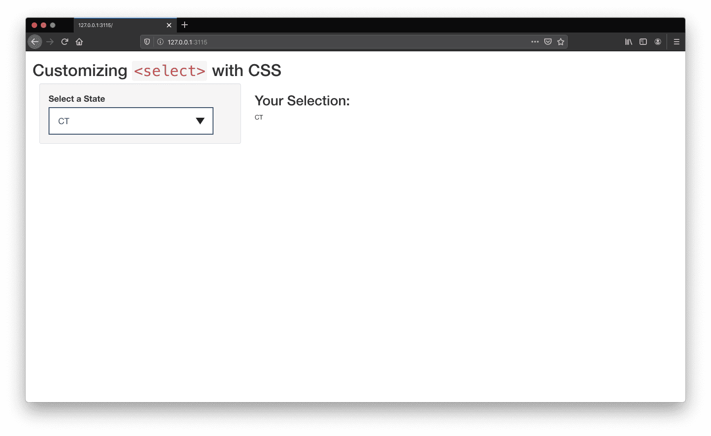

## Contents

1. [Why would I need this?](#about)
2. [How do I get this working](#work)
    1. [Preparing the UI](#work-ui)
    2. [Adding CSS](#work-css)
3. [Futher Thoughts](#further-thoughts)
4. [How do I run the example](#run)

> This tutorial uses a bit of html and css. Some knowledge will help, but it is not required. I'll try to explain things as I go and provide links to additional resources. As always, questions and suggestions are welcome!

> Also, I'm the process of developing an new example that demonstrates how to build a completely custom input element. Stay tuned! 

<span id="about"></span>

## Why would I need this?

This example was developed in response to the R community post titled, [selectInput -- CSS Customization](https://community.rstudio.com/t/selectinput-css-customization/12664), which asked the following:

> Hi everyone, do you know is there a way to configure selectInput in a more meta way using CSS? For example, I want the background of the first option to be green; is there a way to do it?

The beauty about the shiny package is that there are a lot of "out-of-the-box" features and tools. You really don't have to mess around with styling or adding interactivity, which allows you to focus on the data (the most important part of your app). As you progress as a shiny developer, you may find that you need to design pages that meet specific branding guidelines (using corporate css for example) or you want certain elements to look and behave in certain way. Under the hood, shiny uses [bootstrap](https://getbootstrap.com), which is a popular UI library for building websites and applications. This means that if you want shiny elements to have specific appearances, then you will have to overwrite bootstrap styles, which can get very messy. This is were having knowledge in html, css, and javascript come in handy.

To address the original question, we will create our own select input with html and style it with css.

> I would use caution before implementing this approach in any production application without extensive testing. This example uses the css property `appearance` which is still fairly experimental. This may cause elements to behave and look differently across browsers and devices. Check a CSS coverage site such as caniuse.com for browser support and implementation guidelines. Also, conduct tests on the target browsers and devices before moving your app to production.

In the future, I plan on developing tutorials that provide more alternatives so stay tuned! 

For now, we will create an application with a custom select input. We will also display the selection in an output element just to demonstrate that the input is working with shiny. Here is what the final app will look like.



<span id="work"></span>

## How do I get this working?

I will cover two steps in this tutorial. 

1. Prepare the UI: learn how to structure our input in shiny
2. Add CSS: define the appearance of the input

Let's get started!

<span id="work-ui"></span>

### Preparing the UI

First, let's figure out how we are going to write our input element. 

If we take a look at the docs for the [select](https://developer.mozilla.org/en-US/docs/Web/HTML/Element/select) element, we can see that there are a few elements that are standard practice. 


```html
<!-- from the docs: 04 Nov 2019 --->
<label for="pet-select">Choose a pet:</label>

<select name="pets" id="pet-select">
    <option value="">--Please choose an option--</option>
    <option value="dog">Dog</option>
    <option value="cat">Cat</option>
    <option value="hamster">Hamster</option>
    <option value="parrot">Parrot</option>
    <option value="spider">Spider</option>
    <option value="goldfish">Goldfish</option>
</select>
```

The `<label>` element is required as it acts as a title for the input. The `for` attribute is also required as it links the label with the input element (this important for individuals who use screen readers or other web assistive technologies). The `for` always references the `id` of the input element. 

The main element is `<select>`, which acts as a control mechanism for a series of choices, or `<options>`. It's good practice to use the `name` attribute and an `id`. To create our list of options (i.e., choices to choose from), each option is wrapped in an `<option>` tag and given a unique value. The option and value should relate to each other (the title `Dog` relates to the value `dog`). It's also a good idea to have a blank option as demonstrated in the example above as this will allow you to run functions when a valid selection is made.

This how you would write a select input in HTML, how do we write this in shiny?

In shiny, writting html is bit different. In this example, we will use the `tagList` aproach. The select element in shiny can be used by typing:

```r
tags$select(...)
```

A full list of all HTML5 shiny tags can be found in the [Shiny Tags Glossary](https://shiny.rstudio.com/articles/tag-glossary.html).

Let's take a look at the example from the original post.

```r
...
selectInput("state", "Choose a state:",
    list(
        `East Coast` = c("NY", "NJ", "CT"),
        `West Coast` = c("WA", "OR", "CA"),
        `Midwest` = c("MN", "WI", "IA")
    )
)
...
```

The select input was given an input id of `state` and given the label `Choose a state:`. We won't really change anything to these elements. 

Now the use `list` is a bit interesting. This is grouping similar options together by a similar title. In shiny, we aren't expose to what is going on behind the scenes, but here's what is happening. 

1. Create an `<option>` for each state (i.e., NY, NJ, etc.)
2. It will group options into three groups i.e., East Coast, West Coast, Midwest
3. Create labels for each group of options

Groups of options can be created by wrapping the desired `<options>` in an [option group](https://developer.mozilla.org/en-US/docs/Web/HTML/Element/optgroup): `<optgroup>`. We will use the property `label` to give a title for the groups of options.

Let's start building our input. First, the label.

```r
# <label> via tags$label
tags$label("for"="state", "Select a State", class="input-label"),
```

Second, we can start creating the shell for the select input. We are using the id provided in the example and let's add the default option too.

```r
# <select> via tags$select
tags$select(id="state",
    
    # default
    tags$option(value = "none", ""),
    ...
)

```

Now, let's add the options. Remember, we are wrapping similar options in the `<optgroup>` tag. In shiny, it is `tags$optgroup(...)`. We will also assign a label for each group. Here's what that looks like.

```r
# input
tags$select(id="state",
            
            # default
            tags$option(value = "none", ""),
            
            # east coast
            tags$optgroup(label = "East Coast",
                tags$option(value = "NY", "NY"),
                tags$option(value = "NJ", "NJ"),
                tags$option(value = "CT", "CT")
            ),
            
            # west coast
            tags$optgroup(label = "West Coast",
                tags$option(value = "WA","WA"),
                tags$option(value = "OR","OR"),
                tags$option(value = "CA","CA")
            ),
            
            # midwest
            tags$optgroup(label = "Midwest",
                tags$option(value = "MN","MN"),
                tags$option(value = "WI","WI"),
                tags$option(value = "IA","IA")
            )
)
```

That's it! Start the app and take a look. 

It's kind of boring isn't it? Let's start adding our styles.

<span id="work-css"></span>

### Adding CSS

In order to add styling to the input, we will use the css property `appearance` and set it to `none`. (webkit and moz are [vender prefixes](https://developer.mozilla.org/en-US/docs/Glossary/Vendor_Prefix) for other browsers). I set the width of the input to 90% of the parent element (sidebarPanel). This will allow the input to be resized accordingly when the browser dimensions are changed (resized). Again, this is still a bit experimental so use with caution.

The rest of the styles are used for giving the input some more space ([padding](https://developer.mozilla.org/en-US/docs/Web/CSS/padding)), setting the [font size](https://developer.mozilla.org/en-US/docs/Web/CSS/font-size) and [color](https://developer.mozilla.org/en-US/docs/Web/CSS/color), removing rounded corners with [border radius](https://developer.mozilla.org/en-US/docs/Web/CSS/border-radius), and defining the [border](https://developer.mozilla.org/en-US/docs/Web/CSS/border) style. 

Since, the property `appearance: none` removes all styles of our input, it will also remove the dropdown icon (which is one on the reasons you shouldn't really override input styles as you are removing browser defaults). However, you can use your own icon as a replacement and set it as a background element.

In the file `www/css/menu-chevron-down.svg`, I wrote an svg icon that can be used as a replacement. We will load it in using the [background](https://developer.mozilla.org/en-US/docs/Web/CSS/background) property. We will position the location of the icon to the right hand side and somewhat in the middle of our input using the [background-position](https://developer.mozilla.org/en-US/docs/Web/CSS/background-position) property. We will also specify that we will only want to render the icon once (hence the use of `no-repeat`; [background-repeat](https://developer.mozilla.org/en-US/docs/Web/CSS/background-repeat)).

Here's the markup. 

```css
/* primary styling for <select> + manually add menu button */
#state {
    -webkit-appearance:none;
    -moz-appearance:none;
    appearance:none;
    width: 90%;
    padding: 15px;
    font-size: 14pt;
    border-radius: 0;
    outline: none;
    border: 2px solid #3A506B;
    color: #3A506B;
    background: url(menu-chevron-down.svg);
    background-repeat: no-repeat;
    background-position: 95% 20px;
    background-color: white;
}
```

Since the element we want to style the select input. We can select the element in our css file a couple of ways. In the above code, we are using the id selector. In our ui, we applied the id `state` to our input element. In css, we can reference that id using `#` + `name` (or `#state`). There are many other types of css selectors that your can use and you can even combine them as well. See the [CSS Selectors](https://developer.mozilla.org/en-US/docs/Web/CSS/CSS_Selectors) for more information and examples.

Now, let's revisit the second part of the question. 

> For example, I want the background of the first option to be green; is there a way to do it?

For the first `<option>` in each `<optgroup>`, set the background to green. For setting the background color, I used descendent selector paths to select the first element in each group.

```css
#state optgroup option:nth-child(1){
    background-color: #31E981 !important;
    color: white;
}
```

This says within the element with the id of state select all option groups, and then select the first child in each group. If you wanted the second item in each group, it would be `:nth-child(2)`. For the third, it would `:nth-child(3)` and so on.

Save the css file and refresh the app. How does it look? Nice, right?

<span id="further-thoughts"></span>

## Futher Thoughts

Before you begin, I would use caution in using this approach as overriding browser defaults can cause things to break or not function properly. This can also result in inconsistencies across browsers and devices. Check site such as caniuse.com for browser support before implementing into your production app.

At the time of writing this post, the browsers I tested the app (Safari, Chrome and FireFox) with rendered the select input the same. However, the differences occurred when the select input was opened. FireFox allowed the background color of the first option to be set whereas Safari and Chrome did not. 

This is due to the complex structure of the select input element and the behaviors that are associated with it. If it were another "easier" element, you wouldn't have much of an issue. However, if you want the base structure of the select input to follow a certain look, then this is for you. 

In a future tutorial, I will cover another way to create and style this element so check back soon!

<span id="run"></span>

## How do I run this example?

You can run this demo by cloning the [github repository](https://github.com/davidruvolo51/shinyAppTutorials) and opening the Rproject file in `select_input_styling` directory. Alternatively, you can run the app through the console using:

```r
install.packages(shiny)
shiny::runGithub(repo="shinyAppTutorials", username="davidruvolo51", subdir="select_input_styling")
```