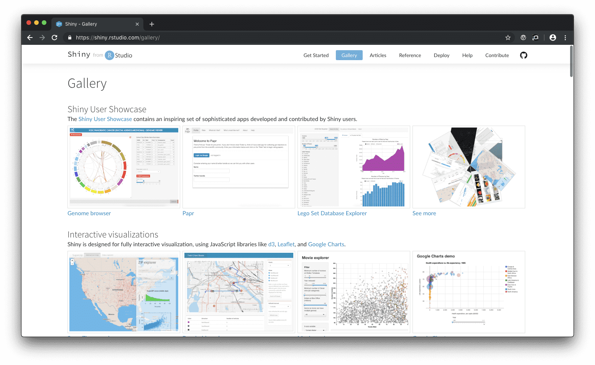
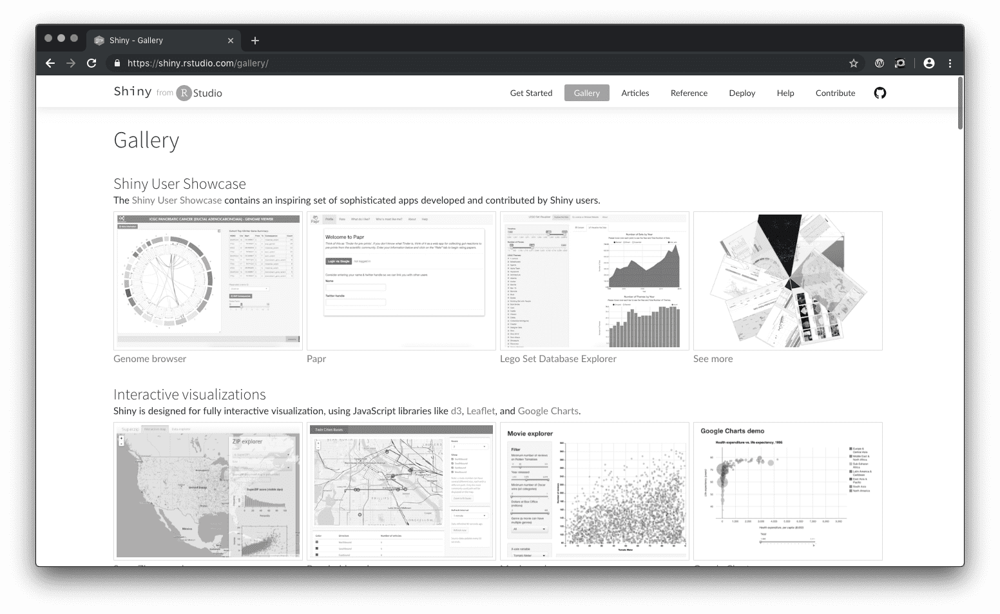
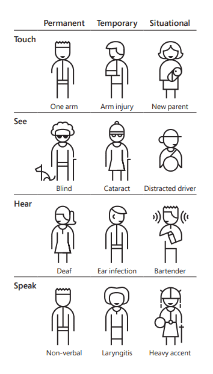

## Contents

1. [What is Web Accessibility?](#what-is-web-accessibility)\
    a. [A Brief Introduction to WCAG](#a-brief-introduction-to-wcag)\
    b. [The Importance of Semantic HTML](#the-importance-of-semantic-html)

<span id="what-is-web-accessibility"/>

## What is Web Accessibility?

>  Accessibility is the practice of making your websites usable by as many people as possible
>
>  <i style="display: block; text-align: right;">\- [mozilla.org](https://developer.mozilla.org/en-US/docs/Learn/Accessibility/What_is_accessibility), accessed on 9 April 2019.</i>


The purpose of web accessibility is to ensure that everyone can access and interact with a site equally in order to extract the information that a site presents. This means that all web elements must work for individuals using assistive technologies and adapt to other conditions that may prevent individudals from accessing or reduce an individuals ability to effectively use a site.

Ensuring colors have high contrast is a common aspect of web accessibility. Consider the following figure. The image on the left shows the shinyapps gallery home page for individuals without visual conditions. The image on the right shows the same site, but without color. Some elements are styled so they are readable without color (e.g., menubar). However, the charts that use color to distinguish groups in the image on the left aren't visible in the image on the right.  

<figure style="text-align: center">


<figcaption>Figure 1: Shinyapps gallery with and without color</figcaption>
</figure>

Color is an important component, but it isn't the only area to consider. If our site has video, we want give users the option to access a transcript of the clip (that can be read or spoken by a screen reader) and have the ability to enable captioning. We also want our site to work well with Assistive Technologies (AT) and that individuals accessing our site with an AT can navigate our site and read our content. 

In web development, conditions are commonly grouped into four categories: visual, auditory, motor/mobility, and cognitive/neurological ([1](#1), [2](#2), [3](#3)). These categories can be expanded even further to include temporary and situational conditions ([3](#3)).

<div style="text-align:center;">



*Source: Microsoft Inclusive Design 101*
</div>

 This is by no means a comprehensive or an "official" list, but it is important to start thinking about who might be visiting your site, how they are viewing content, and in what context.

<span id="a-brief-introduction-to-wcag"/>

### A Brief Introduction to WCAG

The [Web Content Accessibility Guidelines 2.0](https://www.w3.org/TR/WCAG20/) is a set of standards and practices for web accessibility. The guidelines are grouped into four categories: perceivable, operable, understandable, and robust ([4](#4)). As defined by the [WCAG](https://www.w3.org), there are three rating levels: A, AA, and AAA ([5](#5)).

The guidelines can be a bit overwhelming at first. However, there are few tools to help make WCAG compliance and evaluation a bit easier. 

- [Colour Contrast Analyser](https://developer.paciellogroup.com/resources/contrastanalyser/) (macOS, windows)
- [Contrast](https://usecontrast.com/) (macOS)
- [Koa11y Accessbility Evaluation Tool](https://github.com/open-indy/Koa11y)
- [WAVE Accessbility Evaluation Tool](https://wave.webaim.org/extension/) (firefox, chrome)

More tools can be found under a11y's [Quick tips](https://a11yproject.com/#Quick-tests) and [software](https://a11yproject.com/resources#software) lists. Visit the [a11y's checklist](https://a11yproject.com/checklist) and the [Front-end checklist's accessibility section](https://frontendchecklist.io/#section-accessibility) for additional guidance.

Depending on your country of residence, there may be web accessibility-based legislation and policies in effect. Your organization may also have additional guidelines to follow. It's best to check pre-existing recommendations before developing sites or application. Your organization may also have a formal accessibility evaluation before any site or application is launched. If you are in an university setting, check with your institution's branding guidelines (usually buried in your institution's internal network). You may also want to contact your institution for a digital accessibility team (might be in IT, staff and student services, or marketing). For other settings, your organization's marketing or legal department may have this information.

<span id="the-importance-of-semantic-html"/>

### The Importance of Semantic HTML

 In addition to these guidelines, the best recommendation for making sites accessible is to use semantic HTML ([6](#6)). Good accessibility in a site is determined by how well a browser can interpret the structure. For example, there are many front-end frameworks that make buttons using a `<div>` and then apply a lot of css to make it appear as a button. Consider the following example.

```html
<div class="button button-style-submit ..." onclick="..." data-*="..." tabindex="0">
    <p>Submit</p>
</div>
```

The element `<div>` has a few classes added to simulate a button (`button`, `button-style-submit`). Inline events are defined through `onclick` and there are some custom attributes defined through `data-*`. We can also make this element focusable using `tabindex`. However, this is bad practice. Why use this method when there's a native browser button element already available? Screen readers will not intrepret this as a button and therefore, individuals using assistive technologies will not know this element is a button. Instead, this should be rewritten using the `<button>` element and then using javascript to handle events.

*html*

```html
<button id="submit" type="submit">
    Submit
</button>
```

*js*
```js
const submitBtn = document.getElementById("submit");
submitBtn.addEventListener("click", function(event){
    // do something
});
```

Using semantic html well ensure all elements are interpreted by screen readers and can be interacted with using a keyboard.


## References

1. [Mozilla - What is Acessibility?](https://developer.mozilla.org/en-US/docs/Learn/Accessibility/What_is_accessibility)<span id="1"/>
1. [a11y Project -Myth: Accessibility is 'blind people'](https://a11yproject.com/posts/myth-accessibility-is-blind-people/)
1. [Microsoft Design - Inclusive 101](https://www.microsoft.com/design/inclusive/)
1. [WCAG Guidelines at a Glance](https://www.w3.org/WAI/standards-guidelines/wcag/glance/)
1. [WCAG - Conformance](https://www.w3.org/TR/2008/REC-WCAG20-20081211/#conformance)
1. [Mozilla - HTML a good basis for accessibility](https://developer.mozilla.org/en-US/docs/Learn/Accessibility/HTML)

